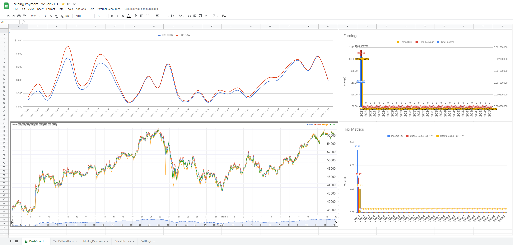

# Google Sheets Mining Tracker for NiceHash

This repositiory contains all the files I used to put together my Google Sheets Mining Tracker.
In order to use this correctly you will need a webserver that supports php, cron, and mysql.
*Note: Skip to Step 5 for an Version 1.5 which does not require a webserver and only uses NiceHash API*

Alternatively with some tweaks the ImportJSON.gs script you could also use a paid source or just paste the data manually into the MiningPayments & PriceHistory workbooks. 

## How to Setup
**⚠️Important:** Before starting, these steps assume you have a webserver that supports php, cron and mysql. If you do not and plan to modify ImportJSON.gs instead to use another service, please skip to step **5**.

1. Copy **config.php**, **copyPrice.php**, **getHistory.php** onto your webserver.
2. Edit **config.php** with your mysql and cryptocompare api key.
    - You can signup for a free account at https://www.cryptocompare.com/ then create a key.
    - Setup other CryptoCompare settings including pairs you want copies to your mysql table, currency type, and exchange.
3. Import the **crypto.sql** file into your mysql database. If you search for data repositories on the internet you should be able to find some documents that can easily be uploaded to the stat_history table with minimal work.
4. Setup a cron job that runs **copyPrice.php** every hour to copy price data to your data from cryptocompare. This will be your historical database. If you would like to copy more often, you will need to edit the **copyPrice.php** script to account for that.
5. Visit https://docs.google.com/spreadsheets/d/1pEDlhGWe1aGEw-nU39MwdpYjP3kwLoBFlulNlw7cP1k/edit?usp=sharing and click **File -> Make a Copy**
    - Alternatively V1.5 of the spreadsheet uses NiceHash API only: https://docs.google.com/spreadsheets/d/1u5LkT1KQ57SA6vSG8YLceLkl6Dz_4uVhCLw9gVoxsbA/edit?usp=sharing
7. Go to the Settings Workbook and update the information
    - Set the domain and directory you are hosting the **getHistory.php** file (Skip this step if you are editing ImportJSON.gs)
    - Set the Coin pair you want to use and how far back you want to load data from (Skip this step if you are editing ImportJSON.gs)
    - Set the NICEHASH API KEY, NICEHASH SECRET KEY, and NICEHASH ORGANIZATION
    - Fill out your Income tax, and Capital gains tax information using the charts provided (please note these may not be accurate)
8. If you are hosting the **getHistory.php** and not editing ImportJSON.gs then you are now complete! Continue reading otherwise.
9. Go to **Tools -> Script Editor** and open the **ImportJSON.gs** file
10. Edit the ImportJSON.gs to work for your service of choice.
    - Depending on how much you change IMPORTJSON function you may need to also update the triggerAutoRefresh.gs, and the PriceHistory workbook at cell A2.

## Post-setup
Now you should have a google spreadsheet setup with all your data, if you need to refresh it there should be a menu option **External Resources -> Refresh**. You can also setup a trigger to run the **triggerAutoRefresh()** function every hour.

## License

Copyright (C) 2021 Mikedmor

This program is free software: you can redistribute it and/or modify
it under the terms of the GNU General Public License as published by
the Free Software Foundation, either version 3 of the License, or
(at your option) any later version.

This program is distributed in the hope that it will be useful,
but WITHOUT ANY WARRANTY; without even the implied warranty of
MERCHANTABILITY or FITNESS FOR A PARTICULAR PURPOSE.  See the
GNU General Public License for more details.

You should have received a copy of the GNU General Public License
along with this program.  If not, see <https://www.gnu.org/licenses/>.

## Donate
Please consider dropping a donation to my paypal, alternative i also accept Cryptocurrency!

UnstoppableDomain: **mikedmor.crypto**

BTC: **bc1q567uzwg03he35m58tljzr30cy6mg9z52d899t4**

ETH: **0xf3Af4e5889ac3D5f605FC42C90476996051De2Fe**

LTC: **LgWgxnwLbmi7nuvn5Lt4g7KKZLpPHjxdZL**
